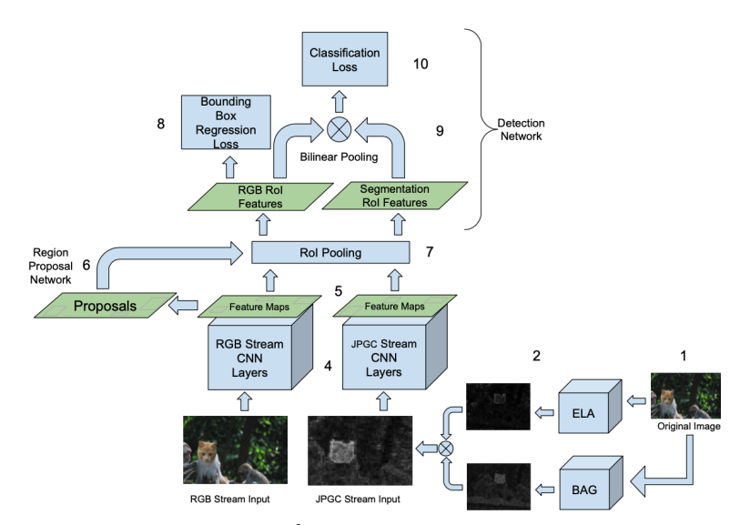

# 图像痕迹隐匿与鲁棒检测

## 一、题目简介

深度伪造（DeepFake）图像检测系统通常依据人脸融合边界、局部纹理异常、频域统计、颜色分布、压缩痕迹以及生成模型留下的空间或频率特征来判断图像是否经过伪造；然而在真实传播链路中，深度伪造图像往往还会经历 JPEG/WebP 重编码、缩放、模糊、噪声、颜色变换、截图或多次转码等后处理，这些处理在基本不改变图像语义与视觉质量的情况下，可能削弱检测器所依赖的取证特征。本题围绕统一的 DeepFake 图像检测服务构建"伪造痕迹隐匿—鲁棒检测"攻防对抗场景：攻击方对主办方提供的 DeepFake 图像设计轻量、查询无关的后处理算法，在保持人物身份、图像语义与视觉质量基本不变的前提下降低未知检测器对伪造图像的识别能力；防御方提交仅凭最终输入图像输出 DeepFake 概率的检测算法，并需同时应对未处理 DeepFake、公开后处理攻击与隐藏组合攻击。通过攻击方与防御方的全对阵评测，综合考查攻击方法的跨检测器迁移能力、视觉保真度与计算成本，以及防御方法的干净样本检测能力、攻击后鲁棒性、误报率与资源消耗。

## 二、算法原理

### 2.1 攻击方原理

攻击方的总体目标是：对主办方提供的任意一张 DeepFake 图像 $I$，设计一个后处理变换 $A$，输出视觉等价的隐匿版本 $I' = A(I)$，使未知检测器输出的伪造概率 $p_f = P(\text{fake}\mid I')$ 尽量低于固定判定阈值 $\tau = 0.5$。攻击方不负责生成伪造人脸，也不得查询防御检测器（黑盒、查询无关），只能使用纯图像后处理。攻击输入输出均为 RGB uint8 图像（赛题统一为人脸检测/对齐/裁剪后的 $256\times256\times3$），输出必须与输入同宽高、同通道数、可解析为 uint8、不含 NaN/Inf，且不允许出现大面积纯色区域；同时须满足视觉保真约束（建议 $SSIM(I,I') \ge 0.92$、$LPIPS(I,I') \le 0.15$，并辅以 $PSNR(I,I') \ge 28\,\text{dB}$ 软约束）。违反任意强制约束的样本直接判定攻击失败：$valid\_attack=0$、$attack\_success=0$。常见技术路线分为五类：**压缩重编码**（JPEG/WebP 重新编码，打乱块边界并量化掉高频痕迹）、**几何重采样**（缩小再放大，破坏局部纹理对齐）、**滤波平滑**（模糊/锐化组合，抑制高频噪声）、**颜色洗白**（Gamma、饱和度、色温等轻微颜色变换，扰动颜色统计特征）、**频域洗白**（FFT/DCT 低通或陷波滤波，直接衰减频域取证分量）；参赛者还可将多个步骤随机串联成 2~4 步的组合攻击，以应对未知检测器。

**Baseline：JPEG 重编码（JPEGReencodeAttack）**。该算法是压缩重编码类攻击中最简单、最具代表性的基线，代码实现为 `attack(sample, quality=85, seed=42) -> {"image": ...}`：输入 `sample["image"]`（RGB uint8 $H\times W\times3$，赛题中 $H=W=256$），输出与输入同尺寸同 dtype 的图像。其原理是：JPEG 有损编码先把图像从 RGB 转换到 YCbCr 并对色度通道做 4:2:0 下采样，再将每个 $8\times8$ 像素块做离散余弦变换（DCT），按"质量"参数对应的量化表丢弃/粗化高频系数，最后熵编码；对伪造图像重新执行"编码→解码"（`PIL.Image.save(format="JPEG")` 再 `open` 回读）会打乱原图的块边界与压缩痕迹，并量化掉融合边界振铃、局部纹理异常等高频取证特征，从而削弱依赖频域/高频统计的检测器。实现步骤为：① 将输入数组转为 PIL 图像；② 以默认质量 `quality=85`（赛题最小示例参数，允许从固定质量池 $\{55, 65, 75, 85\}$ 中取值，实现会自动就近收敛到池内）写入 JPEG 内存缓冲；③ 解码回 RGB uint8 数组返回。该算法对每张图像执行常数次编解码，时间复杂度 $O(H\cdot W)$（逐像素）、完全确定性（固定 `seed=42` 仅用于接口一致性）、对检测器结构完全不可知（黑盒、查询无关）、无需训练且仅依赖 Pillow，因此被用作衡量复杂隐匿方法效果的标准攻击基线。

<figure style="margin:10pt auto; text-align:center;">

<figcaption style="font-size:10pt; text-align:center; margin-top:4pt;">JPEG 重编码（JPEGReencodeAttack）算法示意图</figcaption>
</figure>

固定攻击池中的其余攻击作为普通基线在防御鲁棒性评测中使用：**缩放-恢复（ResizeRecoverAttack，A0-2）** 先将 $256\times256$ 图像缩放到 $192$ 或 $224$，再以随机插值（双线性/双三次/区域/兰索斯）恢复回 $256\times256$，破坏局部纹理的对齐与高频细节；**模糊-锐化（BlurSharpenAttack，A0-3）** 先做轻度高斯模糊（半径默认 $1.2$，每次加 20% 抖动），再用 UnsharpMask 重新锐化，抹平边界振铃后部分恢复边缘；**颜色洗白（ColorLaunderingAttack，A0-4）** 对像素施加轻度 Gamma（默认 $0.9$）、饱和度（默认 $1.1$）与色温抖动，扰动依赖颜色统计的检测器；**频域洗白（FrequencyLaunderingAttack，A0-5）** 对每个通道做 FFT，乘以以归一化半径 $r$ 为变量的平滑低通掩膜 $1/\big(1+\exp(12(r-0.35))\big)$ 后逆变换，再按强度 $0.6$ 与原始图混合，直接衰减高频取证分量；**隐藏组合攻击（CompositeHiddenAttack，A0-Hidden）** 从上述公开攻击中随机抽取 $2\sim4$ 步依次串联（固定种子 $7$，可复现但不公开），模拟主办方构造的未公开组合攻击。这些攻击均为纯后处理、查询无关，与 JPEG 基线共享同一保真与合法性约束。

### 2.2 防守方原理

防守方的总体目标是：仅依据最终输入图像 $I$（可能是未处理的 DeepFake，也可能已被任意后处理攻击隐匿）输出其为 DeepFake 的概率 $p_f \in [0,1]$（$1$ 表示高置信 DeepFake），在固定阈值 $\tau=0.5$ 下做到：未处理 DeepFake 检测能力强（Clean 指标高）、攻击后鲁棒性好（Robust 指标下降小）、真实图像误报率低、对未知伪造类型与未知攻击方式有一定泛化能力，同时推理资源消耗低。防御方不会获得标签、伪造类型或攻击名称/参数。真实世界的主流检测器（以 DeepfakeBench 为统一框架）分为三大特征家族：**空间域 CNN**（Xception、MesoNet、EfficientNet-B4 等，在统一人脸裁剪 $256\times256$、归一化到 $[-1,1]$ 后学习融合边界与纹理异常的判别特征）、**频域/噪声残差检测器**（F3Net、SPSL、SRM 等，显式提取 DCT/FFT 频带能量与 SRM 高通噪声残差统计）、**轻量 CNN**（MobileNetV3/EfficientNet-B0 等，在受限算力下部署）。检测器的训练协议通常为：在公开训练集（真实图 + DeepFake 图）上以交叉熵损失训练若干轮（如 DeepfakeBench 中 Meso4 默认 10 轮、Adam、学习率 $2\times10^{-4}$），再在隐藏测试集上评测。

**Baseline：频域统计检测器（FrequencyStatDefense）**。该算法属于频域/噪声残差特征家族，是与 SRM 噪声残差思路一致的轻量化检测器，代码实现为 `FrequencyStatDefense.fit(images, labels)` 与 `predict(image) -> p_f`，并封装为赛题提交接口 `defend(request) -> {"fake_probability": float}`。其原理是：对每张 RGB uint8 图像提取 31 维紧凑频域/统计特征，再用线性分类器判别真假，避免在 CPU 上运行大 CNN。特征组成如下：① 用 3 个标准 SRM 高通噪声残差滤波器（两个 $5\times5$、一个 $3\times3$ 卷积核，分别除以 $12$ 与 $4$ 归一化）对灰度图做卷积，各取均值、标准差、绝对均值与 99%–1% 分位差共 $3\times4=12$ 维，刻画高频噪声残差；② 将灰度图划分为 $8\times8$ 块，对每块做正交 DCT-II 并累加绝对能量谱，取 5 个代表性系数（低频 $0,1,9$ 与高频 $56,63$）的 $\log(1+\cdot)$ 能量及高/低频能量比共 6 维，刻画频带能量分布；③ 对灰度图做全局 FFT，取幅度谱低/高频带（归一化半径 $<0.15$ 与 $>0.4$）的均值与标准差共 4 维；④ 每通道的均值、标准差、极差共 9 维颜色统计。训练步骤为：在 192 张训练图像（96 真 + 96 假）上逐张提取特征 → 用 `StandardScaler` 逐维标准化 → 拟合逻辑回归分类器（$C=1.0$、$max\_iter=500$、种子 42）。推理步骤为：对输入图像提取同一特征向量 → 标准化 → 代入逻辑回归决策值 $w^\top x + b$ → 经 sigmoid 得到 $p_f = 1/(1+\exp(-(w^\top x+b)))$，并钳制到 $[0,1]$。特征提取时间复杂度 $O(H\cdot W)$（块级 DCT 与 FFT 均在 $256\times256$ 上线性完成），分类开销 $O(31)$，单图推理在 CPU 上约 30 ms 量级；模型规模极小、不依赖 GPU 与预训练权重，可直接在提交包内随 `weights/` 一起交付。该基线决策高度依赖高频分量，因此对重编码/滤波类隐匿敏感（攻击后分数显著下降），但对颜色类攻击相对稳健，如实反映了单一特征家族检测器的鲁棒性边界。

固定防御池 D0 还包含一个空域/像素统计检测器 **PixelStatDefense**（普通基线）：对每张图提取 15 维空域特征（每通道均值、标准差、极差、95%–5% 分位差共 12 维，加上灰度图水平/垂直梯度绝对均值与灰度标准差共 3 维），同样经标准化与逻辑回归判别。该检测器捕捉颜色偏移与边缘/纹理统计差异，对 JPEG 重编码相对稳健，但对缩放/模糊/频域攻击敏感，与频域检测器形成互补——这正是赛题建议防御固定池"从不同取证特征家族选取模型"的原因。更进一步的鲁棒化手段（如攻击增强训练：在训练时随机施加 JPEG/模糊/缩放增强，或叠加多种特征家族做集成）可作为参赛防御方的改进方向。

## 三、评估基准

为统一评测攻击与防御方法，本基准（Benchmark）定义了固定的数据划分、统一检测协议与指标计算规则：所有方法均在相同数据、相同训练协议、相同阈值与相同保真约束下评测，保证结果公平可比。

### 3.1 数据集

赛题原始数据以 **FaceForensics++** 为主要人脸 DeepFake 数据源：包含 1000 个真实人物视频及由四种生成方法（DeepFakes、Face2Face、FaceSwap、NeuralTextures）制作的各 1000 个伪造视频，从视频抽帧并做人脸检测/对齐/裁剪后得到统一 $256\times256$ 的人脸图像；DeepfakeBench 还支持 Celeb-DF、DFDC、DeepForensics 等数据集构建隐藏跨域测试集。真实数据集规模大、需申请且对网络/算力要求高，为保证交付基准在任意 CPU 机器上**离线、秒级、确定性**可复现，本交付物内置一个忠实于该任务形态的**合成人脸图像集**：真实图由程序化"类人脸"生成器构建（肤色径向渐变底、眼睛/眉毛/鼻子/嘴/发带、高斯纹理噪声，对应裁剪后的真实人脸）；伪造图在真实图基础上注入"合成融合边界痕迹"（人脸内部椭圆区域的颜色偏移、融合边界带内的高频振铃、内部轻度高频噪声），模拟 DeepFake 生成过程留下的、可被频域与空域特征捕获且可被后处理攻击削弱的取证痕迹。每张图像为 $256\times256\times3$ 的 RGB uint8（像素取值 $0$–$255$），标签 $0$=真实、$1$=伪造。

基准数据输入输出规范如下：

$$
\text{train} = \{\text{images}: [N_{\text{train}}, 256, 256, 3]\ \text{uint8 RGB},\ \text{labels}: [N_{\text{train}}]\ \text{int64}\in\{0,1\}\}
$$

$$
\text{test} = \{\text{images}: [N_{\text{test}}, 256, 256, 3]\ \text{uint8 RGB},\ \text{labels}: [N_{\text{test}}]\ \text{int64}\in\{0,1\}\}
$$

- 基准固定划分为训练集 $N_{\text{train}}=192$ 张（96 真 + 96 假）与测试集 $N_{\text{test}}=96$ 张（48 真 + 48 假），随机种子 $42$ 打乱抽样，样本带唯一 `sample_id`；测试集在整个评测过程中保持干净、不参与任何训练，模拟"隐藏测试集"；
- **统一检测协议**：所有防御检测器都在同一公开训练集（真实 + DeepFake 图）上训练一次，随后在干净测试集与攻击后测试集上评测，不在攻击阶段重新训练；攻击方只读取测试集中的 DeepFake 图，输出同尺寸隐匿图；
- **接口规范**：防御方仅收到 `{"sample_id", "image"}`，返回 `{"fake_probability": float ∈ [0,1]}`；攻击方仅收到 `{"sample_id", "image"}`，返回 `{"image": 同尺寸 RGB uint8}`；
- 若运行环境无网络，基准自动使用内置合成数据（无需任何下载），保证评测流程总能跑通。

### 3.2 指标

设防御检测器 $d$ 对图像 $I$ 输出伪造概率 $p_f = P(\text{fake}\mid I)$，固定二分类阈值为 $\tau = 0.5$。记测试集真实图 $N_{real}$ 张、伪造图 $N_{fake}$ 张。

**（1）准确率（Accuracy）**：在阈值 $\tau=0.5$ 下预测与真实标签一致的比例：

$$
Accuracy = \frac{\#\{p_f \ge \tau,\ y=1\} + \#\{p_f < \tau,\ y=0\}}{N_{real} + N_{fake}}
$$

**（2）ROC-AUC（AUC）**：按 $p_f$ 排序后 ROC 曲线下面积，衡量检测器对真/假的排序能力，与阈值无关：

$$
AUC = \int_0^1 TPR(t)\,dFPR(t)
$$

**（3）等错误率（EER）**：使假阳率等于假阴率的阈值处的误报率：

$$
EER = FPR(\tau^{*}),\quad \tau^{*} = \arg\min_{\tau} \big|FPR(\tau) - FNR(\tau)\big|
$$

**（4）攻击成功率（ASR）**：对攻击 $a$ 与防御 $d$，单检测器下攻击成功定义为该样本合法且被检测器判为真实（$p_f < \tau$），ASR 为成功样本占全部伪造图的比例：

$$
ASR(a,d) = \frac{1}{N_{fake}} \sum_{i=1}^{N_{fake}} \mathbb{1}\big[valid_i = 1 \ \land\ p_{f,i} < \tau\big],\quad \tau = 0.5
$$

**（5）视觉保真指标（SSIM / PSNR）**：攻击后图像 $I'$ 相对原图 $I$ 的结构相似度与峰值信噪比：

$$
SSIM(I,I') = \frac{(2\mu_I\mu_{I'} + C_1)(2\sigma_{II'} + C_2)}{(\mu_I^2 + \mu_{I'}^2 + C_1)(\sigma_I^2 + \sigma_{I'}^2 + C_2)},\qquad
PSNR(I,I') = 10\log_{10}\frac{255^2}{MSE(I,I')}
$$

其中 $C_1=(0.01\times255)^2$、$C_2=(0.03\times255)^2$。保真软约束为 $SSIM \ge 0.92$、$PSNR \ge 28\,\text{dB}$（LPIPS $\le 0.15$ 需预训练感知网络，作为可扩展项）。

**（6）攻击资格线（Qualified）**：攻击方法须满足合法攻击率与平均保真的联合条件：

$$
qualified = \mathbb{1}\big[valid\_rate \ge 0.80 \ \land\ mean\_SSIM \ge 0.92\big]
$$

其中 $valid\_rate$ 为通过合法性检查（形状/通道/uint8/无 NaN/无大面积纯色）的样本占比。

**（7）鲁棒 AUC（RobustAUC）**：将全部合法攻击产生的攻击后伪造图与原始真实图池化后计算的 AUC，衡量防御在攻击集合下的整体鲁棒性：

$$
RobustAUC = AUC\big(\{p_f(I'_j)\}_{j=1}^{M} \cup \{p_f(I_k)\}_{k=1}^{N_{real}};\ \{1\}^{M} \cup \{0\}^{N_{real}}\big)
$$

其中 $I'_j$ 为合法攻击后的伪造图，$M$ 为其总数；对应地，各单个攻击的 per-attack AUC 以"该攻击后伪造图 + 原始真实图"计算，隐藏组合攻击（composite_hidden）的 AUC 单独报告。

**最终评分**：攻击方得分 = 其方法在固定防御池 $D_0$ 各检测器上的 $ASR$ 均值，越大越优：

$$
Score_{attack} = \frac{1}{|D_0|} \sum_{d \in D_0} ASR(a,d)
$$

防御方得分 = 干净检测能力与攻击后鲁棒性的综合，即 CleanAUC 与 RobustAUC 的均值，越大越优：

$$
Score_{defense} = \frac{CleanAUC + RobustAUC}{2}
$$

防御方须先通过清洁门禁（CleanAUC 明显高于随机、真实图误报率低），再按综合得分排名；攻击方须通过资格线方可进入正式排名。
